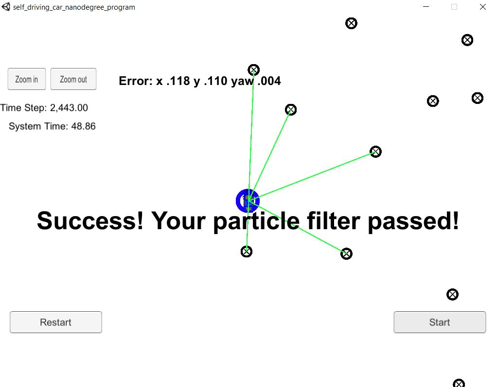

# Project: Kidnapped Vehicle Particle Filter Localizer

The particle filter localizes the vehicle's location within the desired accuracy. Likewise, the particle filter runs within the specified time of 100 seconds:

As you can see the output in the simulator says, "Success! Your particle filter passed!"

Overview
---

The purpose of this project was to implement a 2 dimensional particle filter in C++ to localize a kidnapped vehicle that had been taken to a somewhat unknown location. The particle filter performed 4 phases to predict the vehicle's unknown location. First the filter was initialized with the vehicle's initial gps location data. Next the filter predicted the vehicle's next location from the previous location until the vehicle's unknown location was predicted. The filter then transformed the sensor observations from vehicle coordinate points into map coordinates.  These observations were associated with the closest landmarks on the map. The likelihood that the particle made those observations were calculated based on the associated landmark positions on the map. Finally, the particles were resampled based on the probability that a particle made those observations of the associated landmarks. The ultimate goal of the project was to build a Particle Filter that achieves high prediction accuracy for a car's location, yet performs efficiently.

Localization Background
---

Robot localization is the process in which a robot gathers information about its current environment and compares that to a known map to understand where it is in the world. A Particle Filter is often used for predicting the location of a vehicle to achieve high accuracy in the range of 3-10 cm. This filter typically fuses together LiDAR data and RADAR data to achieve a prediction accuracy of 3-10 centimeters when locating a vehicle. Localization is what allows a self-driving car to know precisely where it is located. Without localization, it would be impossible for a self-driving car to drive safely since location is an essential precursor to making safe driving decisions about future actions.

Contents
---

- **[src](src)**: contains source code for the project
- **[src/main.cpp](src/main.cpp)**: main file is executed after running **./run.sh** shell script. main.cpp acts as a web server that reads sensor observation data (similar to gps data) from the simulator client. main.cpp calls on **init()**, located in **[particle_filter.cpp](src/particle_filter.cpp)**, to initialize the particle filter with the kidnapped vehicle's initial location. main.cpp then calls on **prediction()** to predict the vehicle's next location from the previous location data. main.cpp then calls on **updateWeights()** to transform the observations from vehicle coordinate to map coordinate, associate the closest landmarks on the map with each observation and compute the likelihood that a particle made those observations based on the associated landmark positions. main.cpp calls on **resample()** to resample particles keeping only the particles that probably made those observations. main.cpp then calculates highest and average weighted error and sends those results back to the simulator client.
- **[Docs](Docs)**: contains images and later will have a writeup discussing how I implemented the Particle Filter for localization
- **[data](data)**: contains input data to the particle filter. This folder has **map_data.txt** file, which includes the position of landmarks (in meters) on an arbitrary Cartesian coordinate system. Each row has three columns: x position, y position, landmark id.
- **[build.sh](build.sh)**: creates build directory, compiles the project into an executable file **particle_filter**
- **[run.sh](run.sh)**: executes the **particle_filter** program
- **[clean.sh](clean.sh)**: removes the build folder and cleans the project
- **[install-linux.sh](install-ubuntu.sh)**: contains bash code to install the tools necessary to run the particle filter project onl linux. This script can be run inside Windows 10 Bash on Ubuntu. There is a similar install script for mac.
- **[CMakeLists.txt](CMakeLists.txt)**: contains directives and instructions describing the project's source files and targets (executable, library, or both). It is a build configuration file that cmake uses to generate makefiles. Then the make command is used to manage compiling the project, use a compiler to compile the program and generate executables. In our case, we retrieve the **particle_filter** executable file, machine language, that runs the c++ program directly on the computer.

Dependencies
---

This project requires the **Term 2 Simulator**, which can be downloaded from this [GitHub link](https://github.com/udacity/self-driving-car-sim/releases).

* cmake >= 3.5
  * All OSes: [click here for installation instructions](https://cmake.org/install/)
* make >= 4.1 (Linux, Mac), 3.81 (Windows)
  * Linux: make is installed by default on most Linux distros
  * Mac: [install Xcode command line tools to get make](https://developer.apple.com/xcode/features/)
  * Windows: [Click here for installation instructions](http://gnuwin32.sourceforge.net/packages/make.htm)
* gcc/g++ >= 5.4
  * Linux: gcc / g++ is installed by default on most Linux distros
  * Mac: same deal as make - [install Xcode command line tools](https://developer.apple.com/xcode/features/)
  * Windows: recommend using [MinGW](http://www.mingw.org/)

How to Run Demo
---

### Build & Compile the Particle Filter Program

Open your terminal ([Windows 10 Ubuntu Bash Shell](https://github.com/james94/P5-Extended-Kalman-Filter-CarND/blob/master), Linux Shell, Mac OS X Shell), then copy the project onto your computer:

~~~bash
https://github.com/james94/P6-Kidnapped-Vehicle-CarND
~~~

This project requires using open source package **[uWebSocketIO](https://github.com/uNetworking/uWebSockets)**. This package facilitates the connection between the simulator and C++ code used in this EKF project by setting up a web socket server connection from the C++ program to the simulator. The C++ program software is a web server and the simulator is a client. There are two scripts for installing **uWebSocketIO** - one for Linux and the other for macOS. 

Run the shell script below to install **uWebSocketIO**, build and compile the C++ EKF program:

~~~bash
cd P6-Kidnapped-Vehicle-CarND
# Linux or Windows 10 Ubuntu (18.04) Bash Shell
./install-ubuntu.sh

# Mac OS X Shell
./install-mac.sh
~~~

> **WARNING**: for the above shell script, choose the one appropriate for your OS

At the end of the install script, the **make** build automation tool uses the compiler to compile the project and the following executable program **particle_filter** will be generated in the **build** folder. Run the particle filter program with the command below:

~~~bash
./run.sh
~~~

Let's say you make updates to the C++ particle filter program, all we need to do is rerun the build and compile commands using the shell commands below:

~~~bash
./build.sh
~~~

Rerun the particle filter program with the command below:

~~~bash
./run.sh
~~~

The output you will receive in your terminal:

~~~bash
Listening to port 4567
~~~

Now we need to finish connecting the C++ program to the simulator.

### Launch the Simulator and Connect the C++ Program

Go to the folder where  you downloaded **Term 2 Simulator**, decompress the **term2_sim_{your_OS}** and double click on **term2_sim** to launch the program.

Click **Play!**. Select **Project 3: Kidnapped Vehicle**.

Now referring back to your terminal, you should see an update:

~~~bash
Listening to port 4567
Connected!!!
~~~

Now the simulator and the C++ program are connected. 

### Test Particle Filter's Accuracy and Efficiency

Head back to the simulator, press **Start**.

What will happen now is the particle filter is receiving sensor observation data from the **simulator client**. Then the average weighted error of the particle filter is calculated and output to the simulator, so the simulator can evaluate the particle filter's prediction accuracy for localizing the vehicle. Additionally, the particle filter will need to localize the vehicle within 100 seconds or less. If these two conditions, the simulator reports that your particle filter passed.

You should see the vehicle travel through the environment and take approximately 2400 steps while orientation and position change. 

After running the C++ program and simulator, you should eventually see the following simulator output message:

~~~
Success! Your particle filter passed!
~~~

### Summary

Congratulations. You just ran the demo for a Particle Filter C++ program with a Unit simulator. We saw average weighted error reporting in the simulator to tell us how accurate our filter performed with localizing the kidnapped vehicle. Additionally, we had to find this kidnapped vehicle within a time limit, so we also got to see the filter perform the task efficiently. After the filter succeeded, it performed within `48 seconds` and localized the vehicle with accuracy `x = 0.118, y = 0.110, yaw = 0.004`.

### Input and Output Data Between Client and Server

Here is the main protocol that main.cpp uses for uWebSocketIO in communicating with the simulator.

**INPUT**: values provided by the simulator to the c++ program

// sense noisy position data from the simulator

["sense_x"]

["sense_y"]

["sense_theta"]

// get the previous velocity and yaw rate to predict the particle's transitioned state

["previous_velocity"]

["previous_yawrate"]

// receive noisy observation data from the simulator, in a respective list of x/y values

["sense_observations_x"]

["sense_observations_y"]

**OUTPUT**: values provided by the c++ program to the simulator

// best particle values used for calculating the error evaluation

["best_particle_x"]

["best_particle_y"]

["best_particle_theta"]

//Optional message data used for debugging particle's sensing and associations

// for respective (x,y) sensed positions ID label

["best_particle_associations"]

// for respective (x,y) sensed positions

["best_particle_sense_x"] <= list of sensed x positions

["best_particle_sense_y"] <= list of sensed y positions

### Program Written To Accomplish Project

- **[particle_filter.cpp](src/particle_filter.cpp)**: contains the code to initialize the particle filter with the kidnapped vehicle's initial location, predict the vehicle's next location from the previous location data, transform the observations from vehicle coordinate to map coordinate, associate the closest landmarks on the map with each observation, compute the likelihood that a particle made those observations based on the associated landmark positions and resample particles keeping only the particles that probably made those observations.